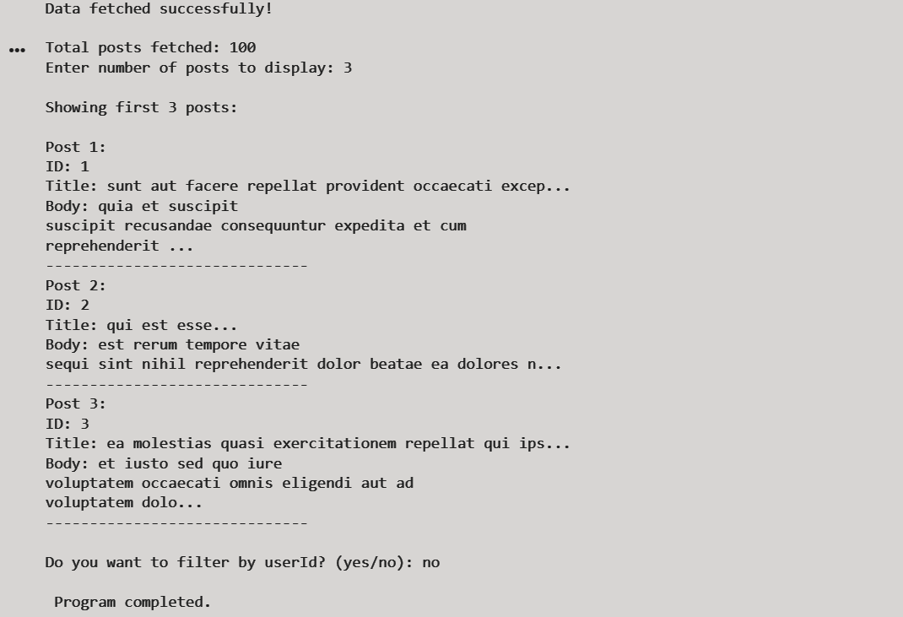
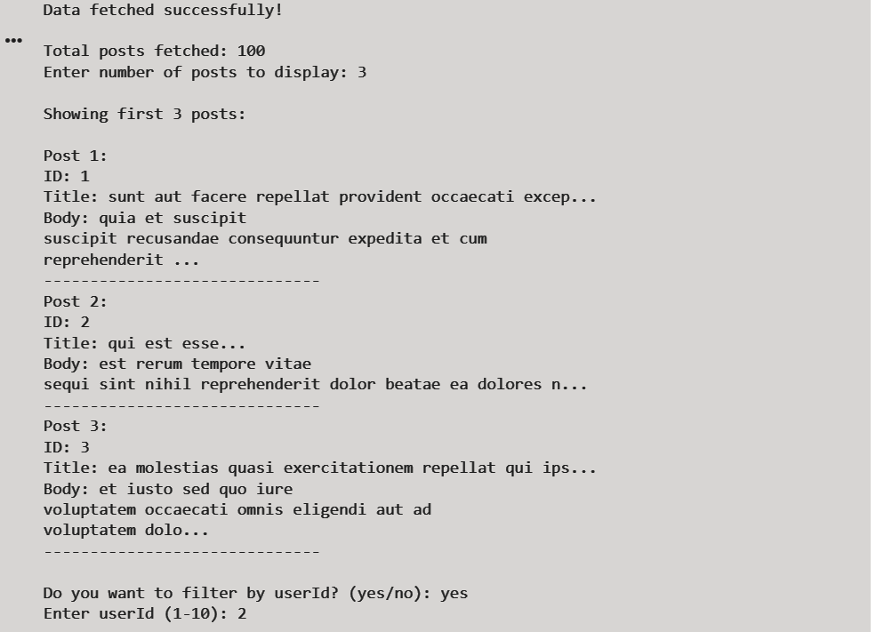
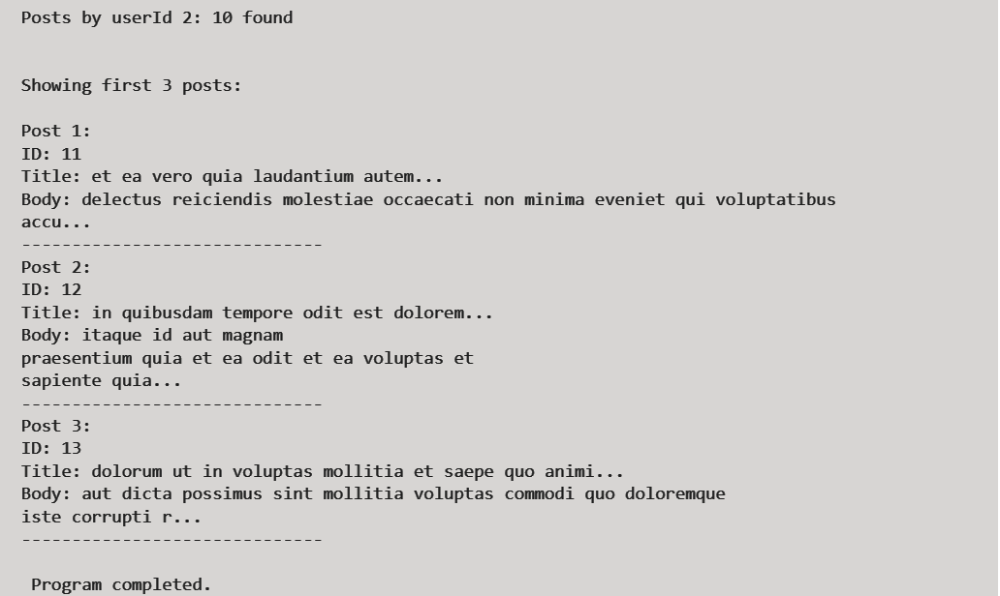

# API Integration Project

## Description
This project fetches data from an API using the requests module, processes JSON data, and displays results with filtering options.

## Features
- Fetch API data
- JSON parsing
- User input support
- Filter posts by userId
- Logging system (api_log.txt)
- Error handling

## How to Run
1. Run the script
2. Enter number of posts
3. Choose filter option

## Sample Input
3  
yes  
1  

## Sample Output
- Displays posts  
- Filters by userId  
- Shows results  

## Output Screenshots

### Normal Output

### Filtered Output

